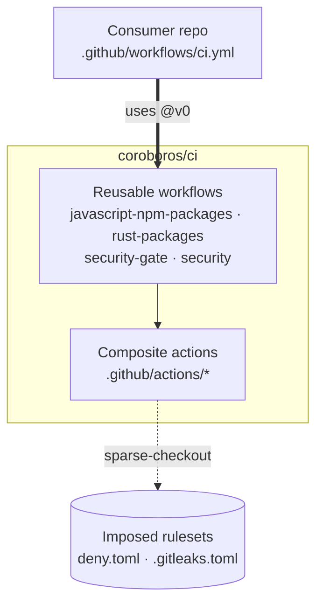

<div align="center">


<!-- omit in toc -->
# coroboros/ci

**Reusable GitHub Actions CI for the Coroboros stack.**

Drop into any `@coroboros/*` repo via `uses: coroboros/ci/.github/workflows/<name>.yml@v0`, or compose around the composite actions under `.github/actions/`.

[](https://github.com/coroboros/ci/releases)
[](https://github.com/coroboros/ci/actions/workflows/self.yml)
[](https://github.com/coroboros/ci)
[](LICENSE.md)
[](https://github.com/coroboros/ci)
[](https://github.com/coroboros/agent-skills)
[](https://coroboros.com)

</div>

**Imposed, not proposed.** Pipelines expose zero `inputs:`. Every Coroboros repo inherits identical install flags, publish auth, and security gates. Consumers wire it in.

- [Architecture](#architecture)
- [Pipelines](#pipelines)
- [Composable actions](#composable-actions)
- [Development flow](#development-flow)
- [Environment](#environment)
- [Security](#security)
- [Examples](#examples)
- [Contributing](#contributing)
- [License](#license)

---

## Architecture



Three layers:

1. **Consumer** — a repo's `.github/workflows/ci.yml` calls a reusable workflow with `uses: coroboros/ci/.github/workflows/<name>.yml@v0`.
2. **Reusable workflows** — `javascript-npm-packages` / `rust-packages` orchestrate the pipeline: `publish` `needs:` the blocking `security-gate`, while the advisory `security` runs in parallel and never blocks.
3. **Composite actions** (`.github/actions/*`) — the shared steps; the security composites sparse-check the canonical rulesets (`security/{deny.toml,.gitleaks.toml}`) from this repo at runtime.

The GitHub-Actions sibling of [`coroboros/ci` on GitLab](https://gitlab.com/coroboros/ci) — the same osv-scanner, gitleaks, and cargo-deny gate, expressed as reusable workflows instead of GitLab templates.

---

## Pipelines

Pin `@v0` (rolling major, tracks the latest release) or `@x.y.z` (the workflow file; nested composites still follow `@v0`).

### `javascript-npm-packages.yml`

**Requirements**
- Files — `.node-version`, `package.json`, `pnpm-lock.yaml`, `README.md`.
- `package.json` — `packageManager: "pnpm@X.Y.Z"` (pnpm is the only supported manager, run via corepack), `scripts.lint`, `scripts.test`; `scripts.build` optional.
- Secrets — see [Environment](#environment).

**Jobs**

<details>
<summary><em>preflight</em></summary>

<br>

**Trigger**: `branch push`

1. [`check-docs`](#composable-actions)
2. [`javascript/base`](#composable-actions) — install, lint, build, test

</details>

<details>
<summary><em>security-gate</em></summary>

<br>

**Trigger**: `every push` — gates `publish`.

Calls [`security-gate.yml`](#security-gateyml): osv-scanner + gitleaks. A vulnerable dependency or leaked secret blocks the release. See [Security](#security).

</details>

<details>
<summary><em>publish</em></summary>

<br>

**Trigger**: `tag push` — gated by `security-gate`.

1. Checkout `main`
2. [`verify-tag`](#composable-actions)
3. [`check-docs`](#composable-actions)
4. [`javascript/base`](#composable-actions)
5. Pin `package.json` to the tag
6. [`generate-changelog`](#composable-actions)
7. Publish to npm — auth: [Security](#security)
8. [`github-release`](#composable-actions)
9. [`commit-artifacts`](#composable-actions)

</details>

<details>
<summary><em>security</em></summary>

<br>

**Trigger**: `every call`

Calls the advisory [`security.yml`](#securityyml). Reports, never blocks.

</details>

### `rust-packages.yml`

**Requirements**
- Files — `rust-toolchain.toml`, `Cargo.toml`, committed `Cargo.lock`, `README.md`.
- Compile-time assets (`include_str!`, `build.rs` inputs) must stay in the package — the `package` job verify-builds it.
- Optional hooks — `ci/setup.sh` (native build deps), `ci/test.env` + `ci/test-setup.sh` (test fixtures).
- Secrets — see [Environment](#environment), all optional. Binary distribution is opt-in (below); the cargo-deny policy is imposed, no consumer config (see [Security](#security)).

**Jobs**

<details>
<summary><em>preflight</em></summary>

<br>

**Trigger**: `branch push` — matrix `ubuntu` / `macos` / `windows`.

1. [`check-docs`](#composable-actions)
2. [`rust/base`](#composable-actions) — fmt, clippy, test

</details>

<details>
<summary><em>security-gate</em></summary>

<br>

**Trigger**: `every push` — gates `publish`.

Calls [`security-gate.yml`](#security-gateyml): cargo-deny + gitleaks. License policy runs advisory in `security`. See [Security](#security).

</details>

<details>
<summary><em>package</em></summary>

<br>

**Trigger**: `branch push`

Verify-builds the packaged crate, so a compile-time asset dropped from the package fails the PR rather than the tagged publish.

</details>

<details>
<summary><em>publish</em></summary>

<br>

**Trigger**: `tag push` — gated by `security-gate`; skipped if `dist-build` fails.

1. Checkout `main`
2. [`verify-tag`](#composable-actions)
3. [`check-docs`](#composable-actions)
4. [`rust/base`](#composable-actions)
5. [`pin-version`](#composable-actions)
6. [`generate-changelog`](#composable-actions)
7. `cargo publish` — auth: [Security](#security)
8. [`github-release`](#composable-actions)
9. [`commit-artifacts`](#composable-actions)

</details>

<details>
<summary><em>binary distribution (opt-in)</em></summary>

<br>

**Trigger**: `tag push`, when `Cargo.toml` declares `[package.metadata.dist]`. Library crates self-skip.

1. `dist-plan` — per-target build matrix
2. `dist-build` — per-target archives
3. `dist-host` — installers, Homebrew formula, npm shim; uploads assets, undrafts the release
4. `dist-publish` — tap + npm shim

The pipeline owns the single release; cargo-dist only builds. Consumer config — the cargo-dist metadata, with `allow-dirty = ["ci"]` in `[workspace.metadata.dist]`. Per-target features via `cfg`; shared binaries are CPU-only. `HOMEBREW_TAP_TOKEN` / `NPM_PACKAGE_REGISTRY_TOKEN` optional.

</details>

<details>
<summary><em>security</em></summary>

<br>

**Trigger**: `every call`

Calls the advisory [`security.yml`](#securityyml). Reports, never blocks.

</details>

### `security-gate.yml`

The blocking gate, split from the advisory layer so it can be owned as a black box. Two parallel jobs, both fail the release through the caller's `needs:` graph — a dev can't bypass them:

- **`supply-chain`** — auto-routed by ecosystem: a `Cargo.toml` repo runs [`security/rust/cargo-deny`](#composable-actions) (advisories + bans + sources); any other runs [`security/osv-scanner`](#composable-actions). One tool per repo, never both, so a crate isn't vuln-scanned twice. A repo with no supported manifest skips (osv's no-manifest path).
- **`secret-scan`** — [`security/gitleaks`](#composable-actions), full git history, canonical ruleset.

Imposed on every package pipeline (a `security-gate` job `needs:`-ed by `publish`) and importable directly by a non-package repo. Holds only what *blocks*: a compromised dependency or a leaked secret. License and quality policy live in `security.yml`.

### `security.yml`

The advisory layer — reports, never blocks (parity with GitLab's `allow_failure: true`):

- **`dependency-review`** — PR-only; needs repo's **Dependency graph** enabled. Fails on high-severity CVE introduced by the dep diff. Uses `actions/dependency-review-action@v4`.
- **`licenses`** — Rust-only (`continue-on-error`): [`security/rust/cargo-deny`](#composable-actions) `checks: licenses` against the canonical allow-list. A non-allowed license is surfaced, never blocks the release. Skips a repo with no `Cargo.toml`.

---

## Composable actions

| Action | Type | Purpose |
| :--- | :--- | :--- |
| `check-docs` | transverse | Context dump + documentation check. |
| `javascript/base` | JavaScript | Sets up Node + corepack pnpm, caches the store, writes `.npmrc` from env, then installs, lints, builds (when present), tests. |
| `rust/base` | Rust | Installs the toolchain, caches via `rust-cache`, runs [`rust/native-deps`](#composable-actions), then fmt, clippy, [`rust/test-deps`](#composable-actions), test. |
| `rust/native-deps` | Rust | Runs the optional `ci/setup.sh` native build-dependency hook (sees `CARGO_DIST_TARGET` on a `dist-build` cross leg). Shared by `rust/base` and the `dist-build` matrix. No-op when absent. |
| `rust/test-deps` | Rust | Loads the optional `ci/test.env` into the job env and runs the optional `ci/test-setup.sh` fixture hook before `cargo test`. Used by `rust/base`. No-op when absent. |
| `rust/install-dist` | Rust | Installs cargo-dist's `dist` binary, prebuilt and SHA-256 verified (Linux/macOS/Windows). Shared by the `dist-plan`, `dist-build`, `dist-host` jobs. |
| `rust/pin-version` | Rust | Installs version-pinned `cargo-set-version` (cargo-edit) and stamps `Cargo.toml` to the release tag. Shared by `publish` and the `dist-*` jobs. |
| `security/gitleaks` | transverse | Installs gitleaks (SHA-256 verified), scans with the canonical ruleset, emits SARIF. Behind `security-gate.yml`'s `secret-scan` and self-CI. |
| `security/osv-scanner` | transverse | Scans dependency manifests for known vulnerabilities (OSV.dev); skips a repo with no supported manifest. Behind `security-gate.yml`'s `supply-chain` (non-Rust) and self-CI. |
| `security/rust/cargo-deny` | Rust | Runs cargo-deny against the canonical imposed `security/deny.toml` (sparse-checked from `coroboros/ci`, no consumer override). The `checks` input selects which checks run — `advisories bans sources` for the `security-gate.yml` supply-chain, `licenses` for the `security.yml` advisory layer. |
| `release/verify-tag` | transverse | Fails the release unless the checked-out `main` HEAD matches the tag SHA. Shared by the npm and Rust `publish` jobs — the tag-time jobs that check out `main` to push back; the `dist-*` jobs pin to the tag commit (`github.sha`) instead. |
| `release/generate-changelog` | transverse | SemVer-strict tag guard + generates or reuses the `## vX.Y.Z` section in `CHANGELOG.md` from Conventional Commits. Outputs `body`. Idempotent. |
| `release/github-release` | transverse | Creates the GitHub Release for the current tag, optionally as a `draft`. Body typically chained from `release/generate-changelog`. |
| `release/commit-artifacts` | transverse | Stages the given files and commits them back to `main` as `chore: release ${tag} [skip ci]`. No-op when nothing changed. |

---

## Development flow

Develop with Conventional Commits → tag → push. No manual CHANGELOG, no version bump.

Tags follow **SemVer strict** — `1.2.3`, never `v1.2.3`.

<details>
<summary><em>Branch models</em></summary>

<br>

**main-only** — feature branch → PR → squash-merge to `main` → tag the merge commit → push.

**develop + main** — PR into `develop` → tag → `release/x.y.z` branch → merge to `main` → `main` reflects production.

Nobody pushes directly to protected branches (`main`, `develop`, `release/x.y.z`).

</details>

<details>
<summary><em>Conventional Commits → CHANGELOG</em></summary>

<br>

| Commit type | CHANGELOG subsection |
| :--- | :--- |
| `feat` | Features |
| `fix` | Fixes |
| `refactor` | Refactor |
| `perf` | Performance |
| `docs` | Documentation |
| `chore` / `ci` / `build` | Configuration |
| `test` | Tests |
| `style` | Style |
| Other / non-standard | Others |
| `!:` or `BREAKING CHANGE:` | Breaking Changes (always first) |

Section format: `## vX.Y.Z - DD/MM/YYYY`. Idempotent. Reuses an existing hand-curated section for the tag if present.

</details>

---

## Environment

Zero `inputs:` — configuration flows through the caller's `secrets:` block. Every value is a **secret** (encrypted at rest, masked in logs), never a GitHub `var`.

<details>
<summary><em>Secrets — <code>javascript-npm-packages.yml</code></em></summary>

<br>

| name | required | description |
| :--- | :---: | :--- |
| `NPM_CONFIG_FILE` | ✔ | `.npmrc` content. Written to repo root by `javascript/base`. `${VAR}` references inside are expanded by npm at install time. |
| `NPM_EXTRA_CONFIG` |  | Extra `.npmrc` lines appended after `NPM_CONFIG_FILE`. A **secret** — it lands in `.npmrc`, so it can carry auth material and must stay masked. |
| `NPM_PACKAGE_REGISTRY` | ✔ | npm package registry URL. |
| `NPM_PACKAGE_PROXY_REGISTRY` |  | Optional npm proxy registry URL. |
| `NPM_PACKAGE_REGISTRY_TOKEN` |  | npm Granular Access Token, scoped to the publishing organization with create-new-package permission. Required only for the token bootstrap (first publish of a new scoped package, before npm Trusted Publisher is bound). Absent → OIDC. |

</details>

<details>
<summary><em>Secrets — <code>rust-packages.yml</code></em></summary>

<br>

All optional. A consumer that wires none still gets crates.io plus prebuilt archives and installers on the release; Homebrew and npm activate only when their secret (or OIDC) is configured.

| name | required | description |
| :--- | :---: | :--- |
| `CARGO_REGISTRY_TOKEN` |  | crates.io token. Bootstraps the first publish of a new crate; absent → OIDC Trusted Publishing. |
| `HOMEBREW_TAP_TOKEN` |  | Push access to the Homebrew tap repo named by `tap` in `[package.metadata.dist]`. Absent → the formula publish self-skips. |
| `NPM_PACKAGE_REGISTRY_TOKEN` |  | npm token bootstrapping the first publish of the binary npm shim; absent → OIDC Trusted Publisher. The shim publishes with provenance either way. |

</details>

---

## Security

Three pillars: a blocking [`security-gate`](#security-gateyml) that stops a release on a known vulnerability or leaked secret; supply-chain hardening at the workflow layer (npm firewall + cooldown, Rust `cargo-deny`); and SHA/version-pinned tooling under imposed canonical rulesets.

<details>
<summary><em>Supply chain — npm</em></summary>

<br>

The target: a hijacked maintainer, a typosquat, a `postinstall` payload, or a fresh bad version pulled before it is caught. `javascript/base` enforces four layers — the runner equivalent of the GitLab pipeline's image-baked hardening:

| Layer | Mechanism | Where |
| :--- | :--- | :--- |
| Cooldown | versions under 7 days old are quarantined; `@coroboros/*` excluded so internal publishes flow immediately | consumer `pnpm-workspace.yaml` |
| Firewall | Socket Firewall (`sfw`) proxies the fetch, blocks confirmed-malicious packages before download | `javascript/base` |
| No install scripts | `--ignore-scripts` blocks `postinstall` code execution | `javascript/base` + `.npmrc` |
| Frozen lockfile | `--frozen-lockfile` rejects a stale or tampered `pnpm-lock.yaml` | `javascript/base` |

Cooldown is consumer config — pnpm 11 reads `pnpm-workspace.yaml` (`minimum-release-age` in `.npmrc` on pnpm 10.x):

```yaml
# pnpm-workspace.yaml
minimumReleaseAge: 10080            # 7 days, in minutes
minimumReleaseAgeExclude:
  - '@coroboros/*'                  # internal packages install immediately
```

**Honest gaps.** `sfw` is fail-closed — if it can't install or run, the job fails rather than fetch unprotected. It inspects public-registry fetches out of the box; packages pulled through a private proxy pass uninspected, held instead by the cooldown. pnpm itself is corepack-resolved from `packageManager`, so no floating version reaches the runner.

</details>

<details>
<summary><em>Supply chain — Rust</em></summary>

<br>

GitHub-hosted runners share no hardened base image, so the Rust pipeline enforces its supply-chain controls in the workflow:

| Risk | Rust control |
| :--- | :--- |
| Untrusted source, typosquat | `cargo-deny` sources — crates.io only; git and alternative registries denied |
| Lock drift, tampered dependencies | committed `Cargo.lock` + `--locked` on `clippy` and `test` — fails on a stale or altered lock |
| Known vulnerability | `cargo-deny` advisories — RustSec vulnerabilities, unmaintained, unsound, yanked |
| License drift | `cargo-deny` licenses — allow-list, **advisory** (reports, never blocks) |
| Banned or wildcard dependency | `cargo-deny` bans |

The blocking checks run in [`security-gate.yml`](#security-gateyml); `licenses` runs advisory in `security.yml`. The policy is **imposed** — cargo-deny applies the canonical [`security/deny.toml`](security/deny.toml) via `--config`, sparse-checked from `coroboros/ci` (the [`gitleaks`](#composable-actions) model). A consumer `deny.toml` is ignored, a `deny.exceptions.toml` fails the job. An unfixable transitive advisory is suppressed centrally — a PR adds a justified `ignore = ["RUSTSEC-…"]` to the canonical `deny.toml`, never per repo.

**Publish auth.** crates.io uses OIDC Trusted Publishing by default — a short-lived token per run, no stored secret. `CARGO_REGISTRY_TOKEN` only bootstraps the first publish of a new crate; configure Trusted Publishing afterwards and drop it. The verify build runs on `cargo publish` (no `--no-verify`), catching a crate that only builds in-workspace before the immutable release.

Two residual risks have no clean CI control. Both are documented here:
- **Build scripts run.** `cargo` has no `--ignore-scripts`; `build.rs` and proc-macros execute at build time. `--locked`, `cargo-deny` bans, and dependency review reduce the exposure; they do not remove it.
- **No publish cooldown.** crates.io has no `minimumReleaseAge`, so a freshly hijacked version is held off by the committed lock and `cargo-deny` advisories rather than a time delay.

</details>

<details>
<summary><em>Recommended <code>NPM_CONFIG_FILE</code> contents</em></summary>

<br>

Minimal hardened `.npmrc` for every Coroboros consumer. Stored as a **secret** (encrypted; carries `${VAR}` expansions resolved at install time):

```ini
@coroboros:registry=https:${NPM_PACKAGE_REGISTRY}
save-exact=true
fund=false
audit=false
ignore-scripts=true
package-lock=false
lockfile=true
prefer-online=true
```

| Line | Why |
| :--- | :--- |
| `@coroboros:registry=https:${NPM_PACKAGE_REGISTRY}` | Scope-resolved registry — `${NPM_PACKAGE_REGISTRY}` expands from the same-named secret. |
| `save-exact=true` | Pin exact versions on `add` / `install`. |
| `fund=false` | Suppress funding noise in CI logs. |
| `audit=false` | `osv-scanner` (in `security-gate.yml`) covers vulnerability scans natively. |
| `ignore-scripts=true` | Defense in depth against postinstall supply-chain attacks — backs up the `--ignore-scripts` flag already passed by `javascript/base` on every `pnpm install`. |
| `package-lock=false` | Prevent `npm` from emitting a parasitic `package-lock.json` in pnpm repos. |
| `lockfile=true` | Explicit `pnpm-lock.yaml` enablement. On pnpm 10 the preceding `package-lock=false` is read as `lockfile=false`, which collides with `--frozen-lockfile`; pnpm 11 defaults to `true` and ignores `package-lock` here, so the line is harmless. |
| `prefer-online=true` | Re-fetch dep metadata each install — local cache cannot mask a yanked or republished version. |

</details>

<details>
<summary><em>Publish — OIDC vs token bootstrap</em></summary>

<br>

Auto-detected by `NPM_PACKAGE_REGISTRY_TOKEN` **secret** presence on the consumer repo:

| Token secret | Mode | Command |
| :--- | :--- | :--- |
| absent | **OIDC + provenance** (default) | `pnpm publish --provenance --no-git-checks` |
| present | **Token bootstrap** | `npm publish --ignore-scripts --access public` |

**OIDC + provenance** — no long-lived token in the repo; npm trusts a per-run id-token issued by GitHub Actions for `coroboros/<repo>/ci.yml`. Requires the npm Trusted Publisher form, which only accepts an existing package — so the very first publish has to take the token bootstrap below.

**Token bootstrap** — publishes the first version of a new scoped package. Set two additional **secrets** on the consumer (encrypted; forwarded via the caller's `secrets:` block):

| Secret | Contents |
| :--- | :--- |
| `NPM_PACKAGE_REGISTRY_TOKEN` | npm Granular Access Token scoped to the publishing organization with create-new-package permission. Long-lived; revoke after migrating to OIDC. |
| `NPM_EXTRA_CONFIG` | `${NPM_PACKAGE_REGISTRY}:_authToken=${NPM_PACKAGE_REGISTRY_TOKEN}` — appended to `.npmrc` by `javascript/base`. Stored as a **secret** because it carries auth expansion. |

`npm publish` is used on the bootstrap path (not `pnpm publish`) because pnpm 11 in CI auto-attempts the OIDC token exchange and won't fall back to the `.npmrc` token. `--ignore-scripts --access public` skips publish-time lifecycle hooks (`prepublishOnly` excepted — known `npm` behavior). The tarball is identical to `pnpm publish`'s.

After the first publish, configure the npm Trusted Publisher form (Publisher type: GitHub Actions; Organization: the publishing org; Repository: consumer repo; Workflow filename: `ci.yml`; Environment: empty), then open a `chore(ci):` PR dropping `NPM_PACKAGE_REGISTRY_TOKEN` + `NPM_EXTRA_CONFIG` from the caller's `secrets:` block. Revoke the npm token. `1.0.1+` publishes via OIDC + provenance.

</details>

<details>
<summary><em>Pinning &amp; imposed rulesets</em></summary>

<br>

- **Action pinning.** Third-party actions are pinned to a commit SHA with an inline `# vX` comment — no floating `@main` / `@vX`. Self-CI tooling pins by version with SHA-256-verified tarballs, no `curl | bash`. `.github/dependabot.yml` auto-PRs the SHA bumps; renovate auto-PRs the tool versions.
- **Imposed rulesets.** `security/deny.toml` and `security/.gitleaks.toml` are sparse-checked from this repo at runtime — a consumer can't override them. The gitleaks ruleset adds Resend, Neon, PostHog, and GitHub PAT rules on top of the defaults.
- **Secret isolation.** Each `workflow_call.secrets:` block declares only the secrets the job consumes — no `secrets: inherit`.

</details>

---

## Examples

<details>
<summary><em><code>javascript-npm-packages.yml</code> wire-up</em></summary>

<br>

```yaml
# consumer-repo/.github/workflows/ci.yml
name: CI
on:
  push:
    branches: [develop, main]
    tags: ['*']
  pull_request:
  workflow_dispatch:

jobs:
  ci:
    uses: coroboros/ci/.github/workflows/javascript-npm-packages.yml@v0
    permissions:
      contents: write   # GitHub Release on tag
      id-token: write   # npm OIDC publish on tag
    secrets:
      NPM_CONFIG_FILE: ${{ secrets.NPM_CONFIG_FILE }}
      NPM_PACKAGE_REGISTRY: ${{ secrets.NPM_PACKAGE_REGISTRY }}
      NPM_PACKAGE_PROXY_REGISTRY: ${{ secrets.NPM_PACKAGE_PROXY_REGISTRY }}
      # Token bootstrap (drop both after npm Trusted Publisher is wired — see Security):
      NPM_EXTRA_CONFIG: ${{ secrets.NPM_EXTRA_CONFIG }}
      NPM_PACKAGE_REGISTRY_TOKEN: ${{ secrets.NPM_PACKAGE_REGISTRY_TOKEN }}
```

</details>

<details>
<summary><em><code>rust-packages.yml</code> wire-up</em></summary>

<br>

```yaml
# consumer-repo/.github/workflows/ci.yml
name: CI
on:
  push:
    branches: [develop, main]
    tags: ['*']
  pull_request:
  workflow_dispatch:

jobs:
  ci:
    uses: coroboros/ci/.github/workflows/rust-packages.yml@v0
    permissions:
      contents: write   # GitHub Release + commit-back on tag
      id-token: write   # crates.io + npm OIDC publish on tag
    secrets:
      # First publish of a new crate only — drop once Trusted Publishing is configured (see Security):
      CARGO_REGISTRY_TOKEN: ${{ secrets.CARGO_REGISTRY_TOKEN }}
      # Binary distribution ([package.metadata.dist] in Cargo.toml) — both optional:
      HOMEBREW_TAP_TOKEN: ${{ secrets.HOMEBREW_TAP_TOKEN }}
      NPM_PACKAGE_REGISTRY_TOKEN: ${{ secrets.NPM_PACKAGE_REGISTRY_TOKEN }}
```

</details>

<details>
<summary><em>security on a non-package repo</em></summary>

<br>

A repo that ships no package still imports the security workflows directly — the blocking gate plus the advisory layer:

```yaml
# consumer-repo/.github/workflows/security.yml
name: Security
on:
  push:
    branches: [develop, main]
  pull_request:
  schedule:
    - cron: '0 0 * * 0'   # weekly — catches CVEs published after last push

permissions:
  contents: read

jobs:
  gate:
    uses: coroboros/ci/.github/workflows/security-gate.yml@v0
  advisory:
    uses: coroboros/ci/.github/workflows/security.yml@v0
```

</details>

---

## Contributing

Internal Coroboros CI. Not open to external contributions — issues and pull requests from outside the organization are not accepted.

---

## License

All Rights Reserved. See [LICENSE.md](LICENSE.md).
